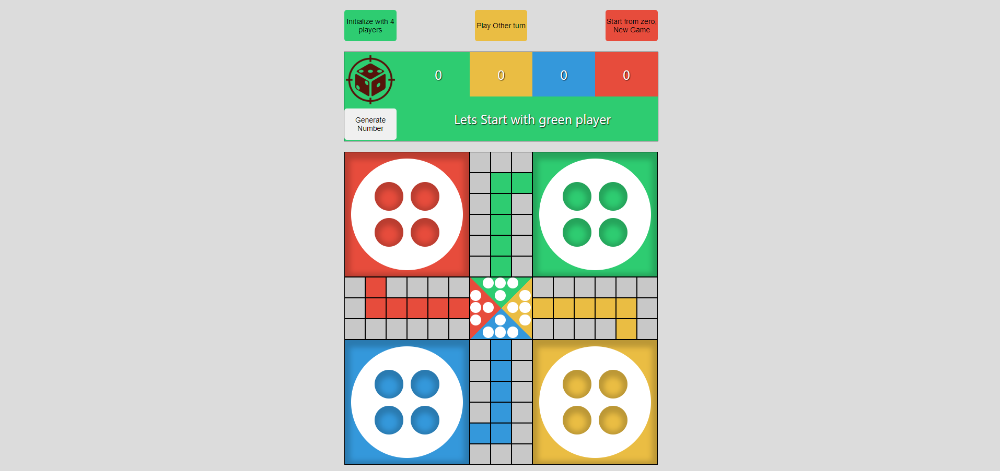

# LUDO Board Game

## What is LUDO game

Ludo is

> a strategy board game for two to four players, in which the players race their four tokens from start to finish according to the rolls of a single die. Like other cross and circle games, Ludo is derived from the Indian game [Pachisi](https://en.wikipedia.org/wiki/Pachisi), but simpler. The game and its variations are popular in many countries and under various names.

## Intro to my LUDO game

LUDO board game I built out is a simple reproduction of the original Ludo Board game as part of my Software Engineering Bootcamp Unit1 Project. It - almost - has all main features and follow the main rules of a standard ludo game.

Although there are some things I was not able to implement them. Its totally an offline 2 OR 4 players game. Hopping - in future - we can add some more features and ideas. this implementations couldn't be implemented so far due to the short schedule and some personal urgent matters I faced during project time.

_Some suggested examples of improvements/ideas for the game:_

- Implement a functionality to let players choose how many players (2 to 4) will play before the beginning of the game.
- Implementation of dice rolling function in order to decide which color plays first.
- Implementing the functionality for game to be played online - using for e.g [soket.io](https://socket.io/) - to be able to play the game online with friends
- Implement a machine learning so anyone - a single human player - will be able to play with the computer.
- Make the functionality of teams mode of players, if it's initialized as 4 players
- implement the functionality of players messages so the players can send messages to each other and to be shown in the board.

## Getting Started

### 1. Prerequisites

Since my game is a **web based game**, so **no hardware** prerequisites needed and **no required specific software** installations. Just a supported - latest version - browser, run the game and have fun!

### 2. Game rules

Below are the rules for my Ludo game.

- The game starts with two colors, each one having 4 pieces (buttons), you can shift it to be 4 players.
- Green color starts the game, being followed by colors yellow, blue and red in 4 players mode, or blue in 2 players mode respectively.
- The game will be played with just one dice.
- In each color's turn, the player must roll the dice and then click in the chosen possible piece (button) in order to make the move.
- A player can only take a piece from the base/home and put into the game if the dice rolls 6.
- Each piece must run across the board until get to it's "home-end triangle".
- After making a move, if there is other players piece in same location, this player piece will be return to the player base/home with a BIG SORRY. the same moved piece player will have a second turn again.
- if the dice rolls 6, the same player will remain have the turn again.
- The first player who moves all 4 pieces to the home-end triangle wins the game.

## Acknowledgments

It's my time to give a BIG THANKS to all my supportive teachers, my wonderful colleagues and other kind persons who shared their opinions with me from choosing my project game to the end of submitting it and achieving the goal of developing and coding this game during this project days. It was a real challenge for me. For that I'll be always gratefull :)
